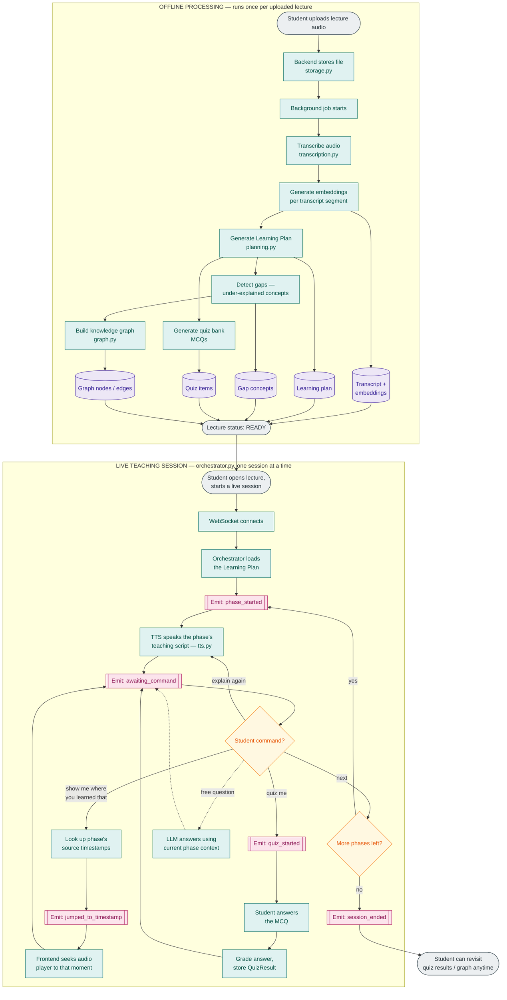

<div align="center">

# 🧠 Blindspot AI

### Discover the gaps. Understand the whole picture.

**Blindspot AI turns a recorded lecture into an active AI teacher — one that plans a lesson, teaches it phase by phase in voice, and can always show you the exact moment in the original recording an explanation came from.**

[]()
[]()
[]()
[]()
[]()

</div>

---

## 📖 Table of Contents

- [Overview](#-overview)
- [The Problem](#-the-problem)
- [The Solution — Teaching With Receipts](#-the-solution--teaching-with-receipts)
- [Key Features](#-key-features)
- [How It Works](#-how-it-works)
- [Architecture](#-architecture)
- [Tech Stack](#-tech-stack)
- [API Reference](#-api-reference)
- [Project Structure](#-project-structure)
- [Getting Started](#-getting-started)
- [Environment Variables](#-environment-variables)
- [Team](#-team)
- [Hackathon Context](#-hackathon-context)
- [Roadmap](#-roadmap)

---

## 🎯 Overview

**Blindspot AI is an AI-powered learning companion that turns a passive recorded lecture into an active, interactive, voice-taught learning session.**

It started from a simple, personally-felt problem:

> **Having access to a lecture is not the same as being taught.**

A lecture is a linear, one-take performance. If the instructor skips a step, speaks too fast, or assumes prior knowledge you don't have, the recording just sits there — unhelpful, waiting for you to scrub through 50 minutes to find the 90 seconds that mattered.

You upload a lecture. Blindspot AI:

1. **Transcribes** it and builds a searchable, timestamped record of everything said
2. **Plans** how to teach it properly — reorganizing the raw content into an ordered sequence of teaching phases, not just a summary
3. **Teaches** it out loud, phase by phase, the way a good TA would in office hours
4. **Proves** every explanation by jumping straight to the exact timestamp it came from, on request
5. **Surfaces gaps** — concepts the lecture mentioned but never fully explained — as a connected knowledge graph
6. **Quizzes** you on what was actually taught, and grades you
7. **Speaks your language** — the same lesson can be delivered and re-explained in Urdu, Spanish, and other languages via neural TTS
8. **Follows you to WhatsApp**, so you can keep asking questions after you close the tab

---

## ❗ The Problem

- **Lectures are linear and irreversible.** If you didn't understand something the first time, your only tool is scrubbing through a timeline blind.
- **Explanatory gaps are common**, especially outside well-resourced institutions — instructors skip steps assuming context the student doesn't have, with no built-in way to fill that gap.
- **Revision is manual and slow.** Making notes, building a study plan, and testing yourself are separate chores students do badly under time pressure, or skip entirely.
- **There's no way to verify AI-generated help against the source.** A generic AI tutor explains a topic from its own general knowledge — which risks teaching something that doesn't match what was actually said in *this* lecture. Traceability back to the original audio is what makes an AI tutor trustworthy for coursework, not just generically educational.

---

## ✅ The Solution — "Teaching With Receipts"

Blindspot AI's core differentiator is **traceability**: every taught concept links back to a verifiable timestamp in the source recording.

```text
Original Lecture Audio
      ↓
Timestamped Transcript
      ↓
Learning Plan (ordered teaching phases)
      ↓
AI Voice Teaching
      ↓
"Show me where you learned that" → jumps to the exact timestamp
```

This is not a transcription tool, and not a generic "chat with your lecture" bot. Two things make it distinct:

1. **Pedagogical planning** — content is re-sequenced and re-taught in phases, not just summarized.
2. **Traceability** — every phase carries the exact source timestamps it was built from, so any explanation can be checked against the original recording on demand.

> **Your lecture recording, taught properly — with receipts.**

---

## ✨ Key Features

| Feature | What it actually does |
|---|---|
| 🎓 **AI Learning Plan** | The planning pipeline reads the full transcript and restructures it into ordered phases, each with a title, a teaching script, prerequisite notes, and the exact source timestamps it was built from. |
| 🗣️ **Voice-Taught Sessions** | A live, WebSocket-driven teaching session speaks each phase aloud and responds to commands — `next`, `explain again`, `show me`, `quiz me`, and free-form questions. |
| 🔍 **Source Traceability** | Ask to see where something was taught and the session jumps the audio player straight to the source timestamp attached to that phase — no re-searching. |
| 🕵️ **Gap Detection & Knowledge Graph** | The planning pipeline flags concepts that were mentioned but under-explained, and builds a graph of nodes and edges showing how concepts relate. |
| 📝 **Quizzes with Grading** | Auto-generated MCQs tied to the lecture content, with answers graded and results stored per session. |
| 🌍 **Multilingual Delivery** | Teaching scripts and Q&A answers can be translated and spoken in multiple languages (including Urdu and Spanish) mid-session, with native neural TTS voices. |
| 🎙️ **Switchable Voices** | Multiple neural voice options for spoken delivery, selectable per session via `/session/voices` and `/session/preferences`. |
| 🖊️ **Interactive AI Whiteboard** | A custom-built, structured SVG canvas engine (not a static image generator): the AI emits drawing commands synced to its speech, supports multi-stage AI-driven courses, handles student interruptions mid-lesson with contextual Q&A, and can replay a full session from its recorded commands. |
| 🛡️ **AI Guardrails** | Planning output is validated against the source transcript before it's trusted (with a retry-with-feedback loop on failure), and live student questions are checked for relevance to the current lecture before being answered as lecture content. |
| 💬 **WhatsApp Integration** | A webhook-verified WhatsApp bridge (via Zernio) that routes incoming text and voice messages into the same AI backend, including searching across a student's own lectures. |

---

## 🚶 How It Works

Blindspot AI runs in two stages: a one-time **offline processing** pass per uploaded lecture, and a **live teaching session** that runs the orchestrator in real time.



---

## 🏗️ Architecture

```text
                     STUDENT
          ┌─────────────┼─────────────┐
          ▼             ▼             ▼
    Web App (Next.js) Voice Input   WhatsApp (Zernio webhook)
          └─────────────┼─────────────┘
                         ▼
              FastAPI backend (main.py)
                         │
        ┌────────────────┼────────────────┐
        ▼                ▼                ▼
  SQLite / PostgreSQL  Cloudflare R2   WebSocket
   (SQLAlchemy ORM)    (audio storage)  (live session events)
        │                                 │
        └────────────────┬────────────────┘
                          ▼
                 AI Orchestrator (orchestrator.py)
                          │
      ┌───────────────────┼───────────────────┐
      ▼                   ▼                   ▼
 Transcription       Planning &          Whiteboard Engine
 (faster-whisper)    Guardrails          (course_manager,
      │              (planning.py,       stage_generator,
      ▼              guardrails.py,      interruption_handler,
 TTS (edge-tts,       graph.py)          session_manager)
 multi-voice,              │
 multilingual)             ▼
                    Groq LLM API
                 (OpenAI-compatible,
                  swappable provider)
```

- **Frontend (Next.js)** — landing page, lecture upload, the `/workspace` teaching UI, a `/whiteboard-lab` sandbox for the whiteboard engine, and a `/settings` page for voice/session preferences.
- **Backend (FastAPI)** — REST endpoints for lectures, sessions, and the whiteboard, plus a WebSocket endpoint that drives the live teaching loop.
- **AI Orchestrator** — the runtime brain of a live session: tracks the current phase, interprets student commands, and decides when to speak, jump to a timestamp, start a quiz, or answer a free-form question.
- **Offline pipeline** — transcription → embeddings → learning-plan generation → gap detection → quiz generation → knowledge-graph construction. This runs once per uploaded lecture, not on every interaction.
- **Storage abstraction** — `storage/local.py` and `storage/r2.py` share the same `save()` / `get_url()` interface, so the app can run entirely on local disk for development or on Cloudflare R2 in production without touching any other code.

---

## 🛠️ Tech Stack

**Frontend**
- Next.js 16 (App Router) + React 19 + TypeScript
- Tailwind CSS, Radix UI primitives, Framer Motion
- `three.js` / `@react-three/fiber` / `@react-three/drei` / `ogl` for the landing page's WebGL background
- A custom SVG-based canvas engine for the interactive whiteboard (`WhiteboardCanvas.tsx` + a dedicated `lib/whiteboard/` engine: audio sync, command interpretation, perception, and speech recognition)

**Backend**
- Python + FastAPI, served with `uvicorn`
- SQLAlchemy ORM over **SQLite by default** (zero setup, auto-created and auto-seeded with starter lectures) or **PostgreSQL** by swapping one `DATABASE_URL` env var — no code changes required
- WebSockets for real-time teaching-session events

**AI / LLM**
- Provider-agnostic OpenAI-compatible client, pointed at the **Groq API** by default (`openai/gpt-oss-120b` as the default model), so the backing model/provider can change without touching application logic
- `sentence-transformers` for transcript-segment embeddings (used in gap detection)
- Planned migration path to Alibaba Cloud Model Studio (Qwen family) once hackathon cloud credits are provisioned

**Speech**
- **Speech-to-Text:** `faster-whisper`
- **Text-to-Speech:** `edge-tts`, with multiple neural voices and multilingual output (translation handled via the LLM layer)

**Storage**
- Cloudflare R2 (S3-compatible, via `boto3`) in production, or local disk for development — both behind the same storage interface

**Messaging**
- WhatsApp Business integration via **Zernio** as the connection/webhook layer

---

## 🔌 API Reference

All routes are mounted under `/api` by `backend/main.py`.

| Method | Endpoint | Purpose |
|---|---|---|
| `POST` | `/lectures` | Upload a lecture (audio/video), kick off background transcription + planning |
| `GET` | `/lectures` | List all lectures |
| `GET` | `/lectures/{id}` | Get a single lecture's status/metadata |
| `GET` | `/lectures/{id}/transcripts` | Get the timestamped transcript |
| `GET` | `/lectures/{id}/plan` | Get the generated learning plan (ordered phases) |
| `GET` | `/lectures/{id}/quiz` | Get the generated quiz bank |
| `GET` | `/lectures/{id}/gaps` | Get detected under-explained concepts |
| `GET` | `/lectures/{id}/graph` | Get the knowledge graph (nodes + edges) |
| `GET` | `/lectures/{id}/audio-url` / `/stream` | Get or stream the source audio |
| `POST` | `/lectures/{id}/qa` | Ask a free-form question about the lecture |
| `POST` | `/lectures/{id}/session` | Start a live teaching session |
| `POST` | `/lectures/{id}/session/{session_id}/command` | Send a command (`next`, `explain again`, `show me`, `quiz me`, …) |
| `GET` | `/lectures/{id}/session/{session_id}/history` | Get session event history |
| `WS` | `/lectures/{id}/session/ws` | Real-time session event stream |
| `GET`/`POST` | `/session/preferences` | Get/set session voice & language preferences |
| `GET` | `/session/voices` | List available TTS voices |
| `POST` | `/whiteboard/generate` | Generate an AI-driven whiteboard lesson |
| `POST` | `/whiteboard/tts` | Generate speech with word-level timing for synced drawing |
| `POST` | `/whiteboard/interruption` | Handle a student's mid-lesson question |
| `POST` | `/whiteboard/review` | Handle a student review/annotation pass |
| `POST` | `/whiteboard/course/start` | Start a multi-stage AI whiteboard course |
| `GET` | `/whiteboard/course/{id}/stage/{idx}` / `/status` | Fetch a course stage or its status |
| `POST`/`GET`/`DELETE` | `/whiteboard/session*` | Save, list, fetch, or delete whiteboard sessions |
| `GET`/`POST` | `/webhook` | WhatsApp webhook verification and inbound message handling (Zernio) |

---

## 📁 Project Structure

```text
blindspot-ai/
├── backend/
│   ├── main.py                        # FastAPI entry point
│   └── app/
│       ├── api/
│       │   ├── v1/endpoints/
│       │   │   ├── lectures.py        # upload, transcript, plan, quiz, gaps, graph, qa
│       │   │   └── session.py         # live session start/command/history/ws
│       │   └── whiteboard.py          # whiteboard generation, courses, sessions
│       ├── core/
│       │   ├── db.py                  # SQLAlchemy engine, init + auto-seed
│       │   ├── paths.py
│       │   └── seed.py                # seeds starter demo lectures
│       ├── integrations/whatsapp/     # Zernio webhook, text/voice handlers, lecture search
│       ├── model/models.py            # Lecture, TranscriptChunk, LearningPlan, Phase,
│       │                               # GapConcept, QuizItem, QuizResult, GraphNode/Edge
│       ├── schemas/schemas.py
│       └── services/
│           ├── ai/
│           │   ├── transcription.py   # faster-whisper
│           │   ├── planning.py        # transcript → learning plan → embeddings → gaps
│           │   ├── graph.py           # knowledge graph construction
│           │   ├── orchestrator.py    # live teaching session brain
│           │   ├── guardrails.py      # grounding + relevance validation
│           │   ├── qa.py              # free-form question answering
│           │   ├── translation.py     # multilingual delivery
│           │   ├── tts.py             # edge-tts speech synthesis
│           │   └── whiteboard/        # course_manager, stage_generator, tts_sync,
│           │                          # interruption_handler, student_review, session_manager
│           └── storage/
│               ├── local.py           # local-disk storage adapter
│               └── r2.py              # Cloudflare R2 adapter (same interface)
│   └── tests/                         # pipeline, orchestrator, guardrails, TTS,
│                                       # multilingual, voice-switching test suites
│
├── frontend/
│   └── src/
│       ├── app/
│       │   ├── page.tsx               # landing page
│       │   ├── workspace/             # lecture library + teaching session UI
│       │   ├── whiteboard-lab/        # whiteboard engine sandbox
│       │   └── settings/              # voice & session preferences
│       ├── components/
│       │   ├── landing/               # hero, features, how-it-works sections
│       │   ├── player/                # audio player
│       │   ├── whiteboard/            # canvas, toolbar, course player, replay
│       │   └── ui/                    # shared UI primitives
│       └── lib/whiteboard/            # audio sync, command interpreter,
│                                       # perception engine, speech recognizer
│
├── docs/
│   ├── MVP_Blueprint_AI_Lecture_Companion.md
│   ├── WhatsApp_Integration_Blueprint.md
│   ├── whiteboard_system_blueprint.md
│   ├── full_workflow_diagram.mermaid
│   └── task.md
│
├── requirements.txt                   # backend dependencies
└── .env.example                       # required environment variables
```

---

## 🚀 Getting Started

### Prerequisites

- **Python 3.11+**
- **Node.js 20.9+** (required by Next.js 16)
- A free **Groq API key** — https://console.groq.com/keys (this is the only credential required to run the AI features locally; everything else defaults to zero-setup local options)

### 1. Clone and configure

```bash
git clone https://github.com/Anas-Shakir/blindspot-ai.git
cd blindspot-ai
cp .env.example .env
```

Open `.env` and set at minimum:

```env
LLM_API_KEY=your_groq_api_key_here
```

By default the app uses **SQLite** (`sqlite:///./blindspot.db`) and **local disk storage** — no database or object-storage setup is required to run it. The database is created and seeded with starter lectures automatically on first run.

### 2. Run the backend

```bash
pip install -r requirements.txt
uvicorn backend.main:app --reload
```

The API is now running at **http://localhost:8000** (health check at `/health`).

### 3. Run the frontend

```bash
cd frontend
npm install
echo "NEXT_PUBLIC_API_URL=http://localhost:8000" > .env.local
npm run dev
```

The app is now running at **http://localhost:3000**.

---

## 🔐 Environment Variables

All variables are documented with inline comments in `.env.example`. They fall into six groups:

| Group | Required? | Purpose |
|---|---|---|
| **LLM (Groq)** | ✅ Required | `LLM_API_KEY`, `LLM_BASE_URL`, `LLM_MODEL` — powers planning, gap detection, Q&A, and whiteboard lesson generation |
| **Database** | Optional | `DATABASE_URL` — defaults to local SQLite; set to a Supabase/Postgres connection string to switch, no code changes needed |
| **Cloudflare R2** | Optional | `R2_ACCOUNT_ID`, `R2_ACCESS_KEY_ID`, `R2_SECRET_KEY`, `R2_BUCKET_NAME` — only needed if you want cloud storage instead of local disk |
| **WhatsApp / Zernio** | Optional | `ZERNIO_API_KEY`, `ZERNIO_BASE_URL`, `ZERNIO_WEBHOOK_SECRET`, `WHATSAPP_BUSINESS_NUMBER`, `WHATSAPP_PHONE_NUMBER_ID` — only needed to enable the WhatsApp channel |
| **Voice** | Optional | `EDGE_TTS_VOICE`, `BACKEND_PUBLIC_URL` — defaults to `en-US-ChristopherNeural`; other voices are listed in `.env.example` |
| **Frontend** | ✅ Required for the frontend | `NEXT_PUBLIC_API_URL` — points the Next.js app at the FastAPI backend |

---

## 👥 Team

A four-person team, split across frontend, backend, AI/planning, and AI orchestration:

- **Anas** — AI Orchestrator & Team Lead
- **Ayesha** — Backend
- **Hashim** — AI / Planning

---

## 🏆 Hackathon Context

Blindspot AI is built for the **Alibaba Cloud AI Hackathon 2026** (Bano Qabil × Alibaba Cloud) — **Regional Round**.

The team is building the full pipeline on free and open-source tools first (Groq's OpenAI-compatible API, `faster-whisper`, `edge-tts`), with a planned swap into Alibaba Cloud's Model Studio (Qwen family models and CosyVoice TTS) once hackathon cloud credits are provisioned — the AI layer is built provider-agnostic specifically to make that swap a configuration change, not a rewrite.

---

## 🗺️ Roadmap

What's built runs end-to-end today: upload → transcribe → plan → teach → verify source → quiz, plus the multilingual voice layer, the interactive whiteboard, and the WhatsApp bridge. What's next:

- **Notes generation** — auto-generated phase summaries and revision notes as a standalone review artifact
- **Production database migration** — moving from SQLite to PostgreSQL with the `pgvector` extension, enabling live semantic search over transcript embeddings (currently, source lookups use the timestamps already attached to each learning phase)
- **Alibaba Cloud Model Studio migration** — swapping the Groq-backed LLM and TTS calls for Qwen-family models and CosyVoice once cloud credits are available
- **Containerized infra** — a `docker-compose` setup for one-command local orchestration of the full stack
- **Richer quiz modes** — scenario-based and application questions beyond the current MCQ format

---

<div align="center">

**Blindspot AI — Discover the gaps. Understand the whole picture.**

</div>
